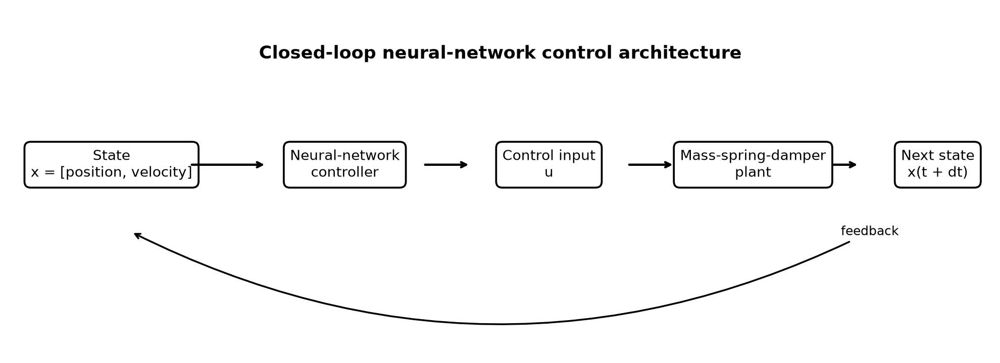
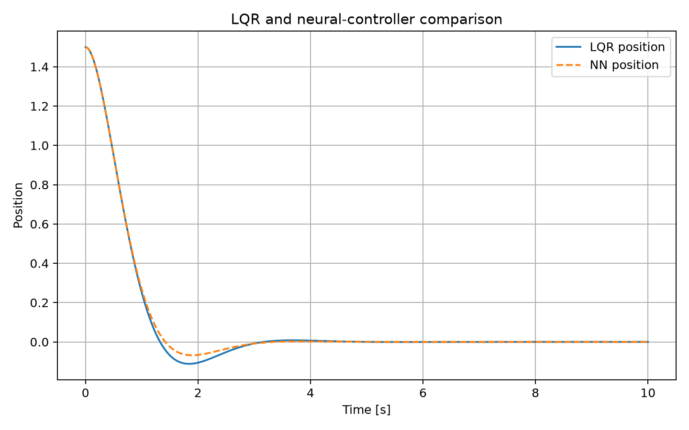
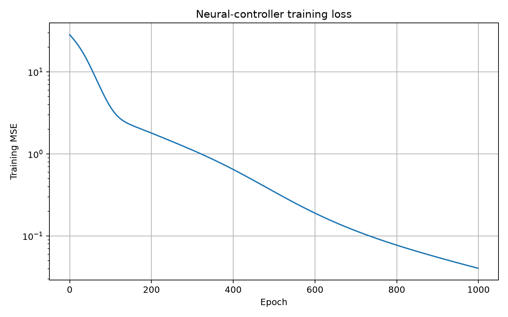
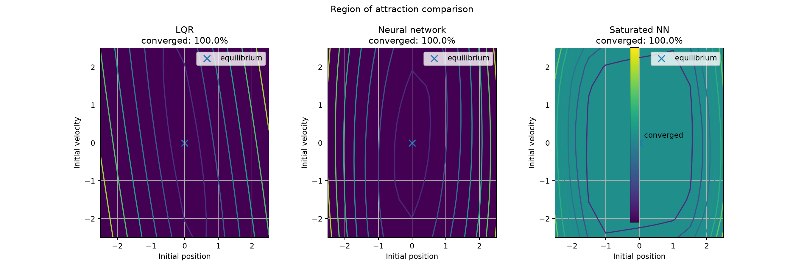

🌐 언어: [English](README.md) | [日本語](README.ja.md) | [한국어](README.ko.md) | [ไทย](README.th.md)

[](https://github.com/wolfchil345/lyapunov-nn-control-lab/actions/workflows/tests.yml)
[](https://github.com/wolfchil345/lyapunov-nn-control-lab/actions/workflows/local-checks.yml)
[](https://github.com/wolfchil345/lyapunov-nn-control-lab/actions/workflows/quality-gate.yml)
[](https://github.com/wolfchil345/lyapunov-nn-control-lab/releases)
[](LICENSE)

# Lyapunov NN Control Lab

LQR 제어기를 모방하는 신경망 제어기를 학습하고, 폐루프 거동을 표본 기반 Lyapunov 해석, 강건성 시험, 인력 영역 추정으로 평가하는 재현 가능한 Python 및 PyTorch 제어 실험입니다.

기계공학, 제어이론, 머신러닝의 접점을 이해하기 쉬운 형태로 다루기 위해 질량-스프링-댐퍼 시스템을 시험 대상으로 사용합니다.

## 주요 특징

- LQR 기준 제어기와 이를 모방하는 신경망 제어기.
- 표본 기반 Lyapunov 패널티를 포함한 안정성 중심 학습.
- 여러 초기조건과 정량적 성능 평가.
- 구동기 포화, 측정 잡음, 파라미터 변화 시험.
- 위상 궤적, Lyapunov 등고선, 인력 영역 비교.
- 재현 가능한 스크립트, 자동 테스트, CI 워크플로, 생성 보고서.
- 영어, 일본어, 한국어, 태국어 문서.

## 제어 루프

```text
상태 x = [position, velocity]
            │
            ▼
 neural-network controller ──► 제어력 u
            ▲                         │
            │                         ▼
            └──── mass-spring-damper plant
```

원점이 평형점으로 유지되도록 제어기에 `u(0) = 0` 제약을 적용합니다.

## 시스템 및 안정성 모델

플랜트는

```text
m q'' + c q' + k q = u
```

이며 상태공간 동역학은

```text
x_dot = A x + B u
```

입니다. LQR 제어기는 모방 목표 `u = -Kx`를 제공합니다. 이차 Lyapunov 후보 `V(x) = x^T P x`에 대해 프로젝트는

```text
V_dot(x) = 2 x^T P (A x + B u)
```

를 표본 상태에서 평가하고 다음 조건의 위반을 벌점으로 사용합니다.

```text
V_dot(x) <= -alpha * ||x||^2
```

이 표본 검사는 경험적 근거일 뿐이며 연속 상태공간 전체에 대한 형식적 증명은 아닙니다.

## 방법

1. 공칭 질량-스프링-댐퍼 플랜트를 정의하고 LQR 기준 제어기를 설계합니다.
2. 상태를 표본 추출하고 LQR 제어 법칙으로 학습 레이블을 만듭니다.
3. 모방 손실과 Lyapunov 패널티로 신경망 제어기를 학습합니다.
4. 여러 초기상태에서 LQR, 신경망, 포화 제어기를 시뮬레이션합니다.
5. 최종 상태 노름, 정착 시간, 이차 비용, 제어 에너지, 최대 제어 입력을 측정합니다.
6. 표본 기반 Lyapunov 거동, 강건성, 추정 인력 영역을 평가합니다.
7. 그림, CSV 지표, 학습 모델, 실험 보고서를 저장합니다.

## 실험과 출력

| 실험 | 목적 | 출력 |
|---|---|---|
| 아키텍처 | 신경망 폐루프 제어 구조 설명 | `results/model_architecture.png` |
| 제어기 비교 | LQR과 신경망 궤적 비교 | `results/position_comparison.png` |
| 안정성 중심 학습 | 전체, 모방, Lyapunov 손실 추적 | `results/training_loss.png` |
| 초기조건 | 여러 상태에서 수렴 확인 | `results/multiple_initial_conditions.png` |
| 구동기 포화 | 제한된 제어력 평가 | `results/saturation_comparison.png` |
| 잡음 강건성 | 잡음이 있는 상태 측정 평가 | `results/noise_robustness.png` |
| 파라미터 강건성 | 질량, 감쇠, 강성 변경 | `results/parameter_robustness.png` |
| 상태공간 분석 | 위상 궤적과 Lyapunov 등고선 표시 | `results/phase_portrait.png`, `results/lyapunov_contours.png` |
| 인력 영역 | 초기상태 격자에서 수렴 비교 | `results/region_of_attraction_comparison.png` |
| 안정성 절제 | Lyapunov 패널티 가중치 비교 | `results/stability_weight_ablation.csv` |
| 자동 보고서 | 생성된 근거 요약 | `results/experiment_report.ko.md` |

전체 수치 지표는 [`results/performance_metrics.csv`](results/performance_metrics.csv)에 있습니다.

## 결과 요약

추적된 결과는 저장소의 고정 난수 시드와 현재 실험 설정으로 생성되었습니다.

| 사례 | 최종 상태 노름 | 정착 시간 | 이차 비용 |
|---|---:|---:|---:|
| LQR, `x0 = [1.5, 0.0]` | `3.35e-06` | `3.37 s` | `14.6481` |
| 신경망, `x0 = [1.5, 0.0]` | `2.75e-07` | `3.25 s` | `14.6803` |
| 포화 신경망, `x0 = [1.5, 0.0]` | `2.73e-07` | `3.28 s` | `14.8506` |

추적된 안정성 가중치 절제에서는 모든 시험 가중치의 표본 Lyapunov 위반 비율이 `0.0`입니다. 실험 영역과 한계 문서와 함께 해석해야 합니다.

## 결과 갤러리

| 아키텍처 | 제어기 응답 |
|---|---|
|  |  |
| **안정성 중심 학습** | **인력 영역 비교** |
|  |  |

생성된 모든 그림은 [그림 가이드](docs/ko/figures.md)에 정리되어 있습니다.

## 설치

Python 3.10 이상이 필요하며 CPU 실행으로 충분합니다.

```bash
git clone https://github.com/wolfchil345/lyapunov-nn-control-lab.git
cd lyapunov-nn-control-lab
python -m venv .venv
source .venv/bin/activate
python -m pip install --upgrade pip
python -m pip install -e ".[dev]"
```

Windows PowerShell에서는 `.venv\Scripts\Activate.ps1`로 환경을 활성화합니다.

## 실행과 검증

짧은 예제를 실행합니다.

```bash
python examples/quick_start.py
```

전체 실험을 실행합니다.

```bash
python main.py
```

표준 검사 또는 전체 준비 상태 검사를 실행합니다.

```bash
make checks
make quality-gate
```

유용한 명령은 [명령어 가이드](docs/ko/commands.md)에 있습니다. `python scripts/clean_results.py`는 알려진 생성 파일을 미리 보여 주며, 실제 삭제에는 명시적인 `--yes`가 필요합니다. 먼저 [실험 워크플로](docs/ko/experiment_workflow.md)를 확인하십시오.

## 프로젝트 구조

```text
lyapunov-nn-control-lab/
├── main.py                 # 전체 실험 파이프라인
├── src/                    # 동역학, 제어기, 분석, 그림 작성
├── tests/                  # 자동 테스트 모음
├── scripts/                # 검사와 재현 가능한 유지관리 명령
├── examples/               # 실행 가능한 최소 예제
├── docs/{en,ja,ko,th}/     # 언어별 문서
└── results/                # 추적 중인 참조 결과와 생성 모델
```

자세한 내용은 [프로젝트 구조 가이드](docs/ko/project_structure.md)를 참고하십시오.

## 과학적 한계

- 플랜트는 실제 하드웨어가 아닌 선형 질량-스프링-댐퍼 시뮬레이션입니다.
- 신경망 제어기는 LQR 교사로부터 학습하므로 표본 영역 밖에서 일반화되지 않을 수 있습니다.
- Lyapunov 및 인력 영역 평가는 유한 격자와 시뮬레이션을 사용합니다.
- 강건성 실험은 선택된 잡음 수준, 입력 제한, 파라미터 변화만 다룹니다.
- 의존성 버전이나 플랫폼에 따라 작은 수치 차이가 생길 수 있습니다.

연구 결론을 내리기 전에 [한계](docs/ko/limitations.md), [결과 해석](docs/ko/results_interpretation.md), [재현성](docs/ko/reproducibility.md)을 확인하십시오.

## 문서

전체 문서 색인은 네 언어로 제공됩니다.

- [영어 문서](docs/en/index.md)
- [日本語ドキュメント](docs/ja/index.md)
- [한국어 문서](docs/ko/index.md)
- [เอกสารภาษาไทย](docs/th/index.md)

주요 문서에는 [방법론](docs/ko/methodology.md), [실험 워크플로](docs/ko/experiment_workflow.md), [모델 카드](docs/ko/model_card.md), [연구 질문](docs/ko/research_questions.md)이 있습니다.

## 커뮤니티와 프로젝트 정보

- [기여 가이드](CONTRIBUTING.ko.md)
- [보안 정책](SECURITY.ko.md)
- [행동 강령](CODE_OF_CONDUCT.ko.md)
- [로드맵](ROADMAP.ko.md)
- [릴리스 노트](RELEASE_NOTES.ko.md)
- [인용 메타데이터](CITATION.cff)

## 라이선스와 작성자

[MIT License](LICENSE)로 공개됩니다.

작성자는 제어공학, 신경망, 안정성 해석에 관심이 있는 기계공학 학생 Sirichet Sriamontham입니다.
