# Lyapunov NN Control Lab

A Python and PyTorch experiment that trains a neural-network controller to imitate an LQR controller and evaluates the closed-loop system using a quadratic Lyapunov function.

## Experiment summary

| Experiment | Purpose | Main output |
|---|---|---|
| Model architecture | Explains the closed-loop NN control structure | `results/model_architecture.png` |
| LQR baseline | Creates a classical optimal-control reference controller | `results/position_comparison.png` |
| Neural-network controller | Trains a neural controller to imitate the LQR law | `results/training_loss.png` |
| Lyapunov grid check | Empirically checks whether V-dot is negative on sampled states | Printed terminal results |
| Stability-aware training | Adds a Lyapunov penalty during NN training | `results/training_loss.png` |
| Multiple initial conditions | Tests convergence from several starting states | `results/multiple_initial_conditions.png` |
| Quantitative metrics | Compares final norm, settling time, cost, energy, and max control | `results/performance_metrics.csv` |
| Actuator saturation | Tests controllers with limited control force | `results/saturation_comparison.png` |
| Noise robustness | Tests the controller under noisy state measurements | `results/noise_robustness.png` |
| Parameter robustness | Tests mass, damping, and stiffness variations | `results/parameter_robustness.png` |
| Phase portrait | Visualizes closed-loop trajectories in state space | `results/phase_portrait.png` |
| Lyapunov contours | Visualizes quadratic Lyapunov level sets with trajectories | `results/lyapunov_contours.png` |
| Region of attraction | Tests convergence from a grid of initial states | `results/region_of_attraction.png` |
| Region of attraction comparison | Compares stabilizable initial states for LQR, NN, and saturated NN | `results/region_of_attraction_comparison.png` |
| Stability-weight ablation | Tests whether stronger Lyapunov penalties improve stability metrics | `results/stability_weight_ablation.png`, `results/stability_weight_ablation.csv` |
| Automatic experiment report | Summarizes generated plots, metrics, and ablation results | `results/experiment_report.md` |

## Results gallery

### Model architecture

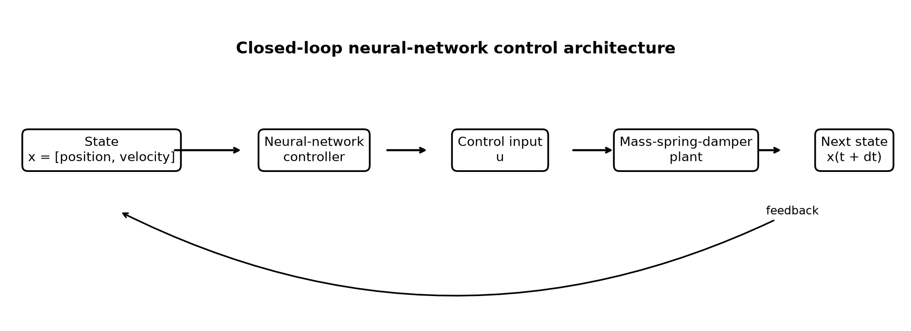

### Controller comparison

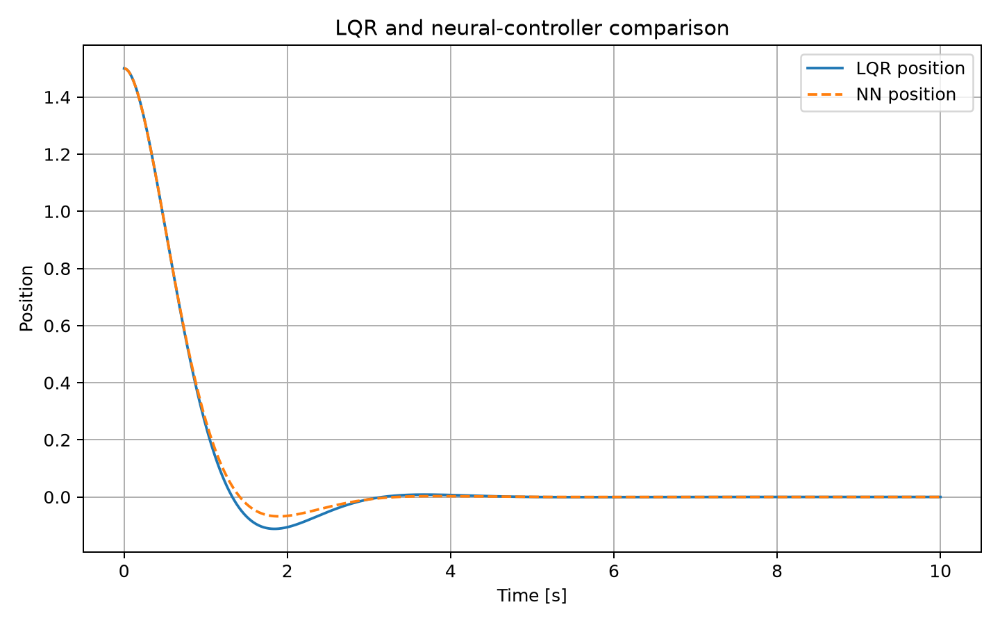

### Training loss

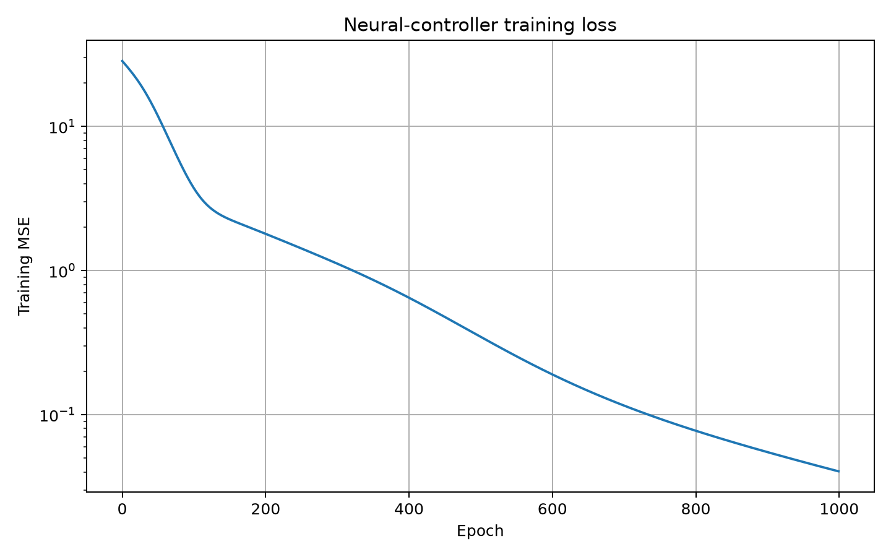

### Multiple initial conditions

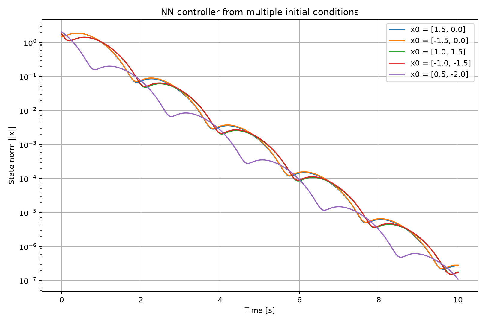

### Actuator saturation

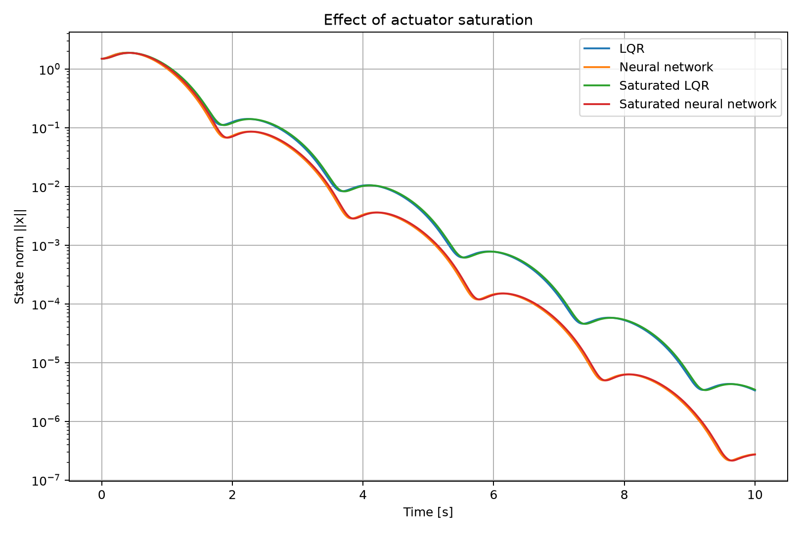

### Noise robustness

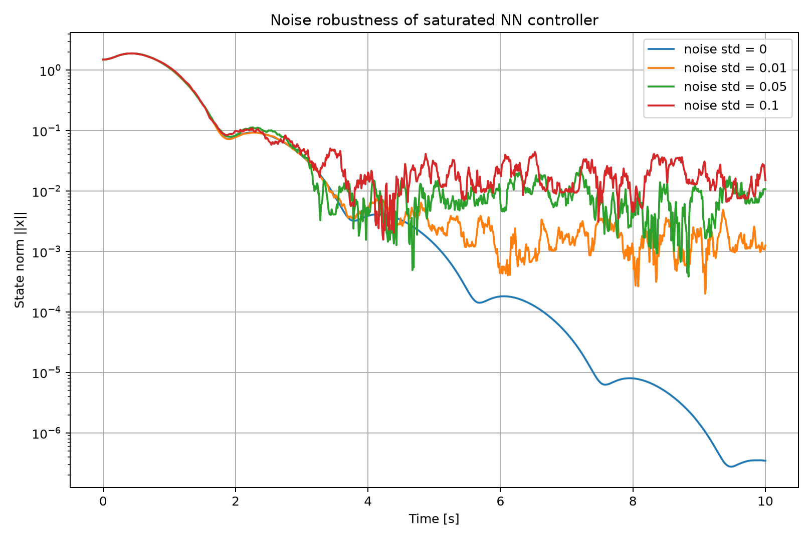

### Parameter robustness

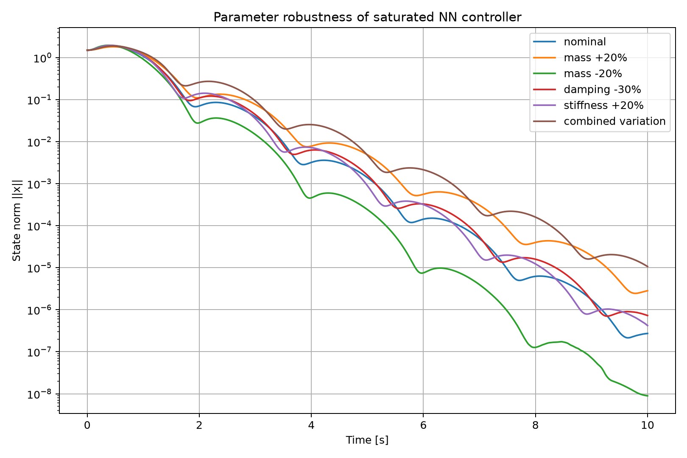

### Phase portrait

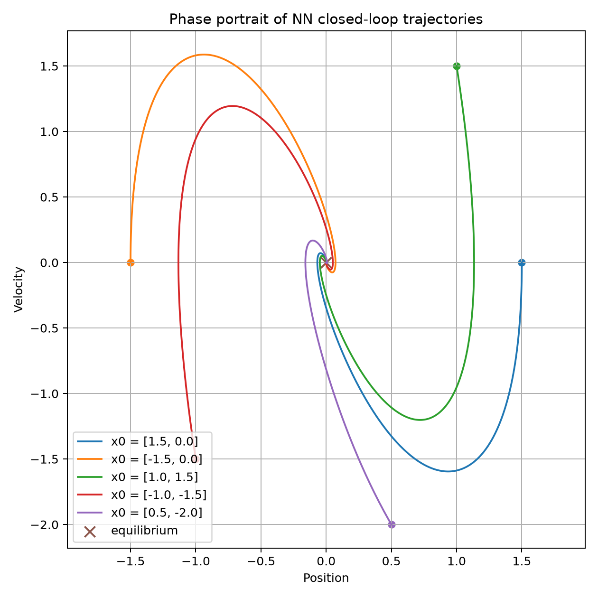

### Lyapunov contour analysis

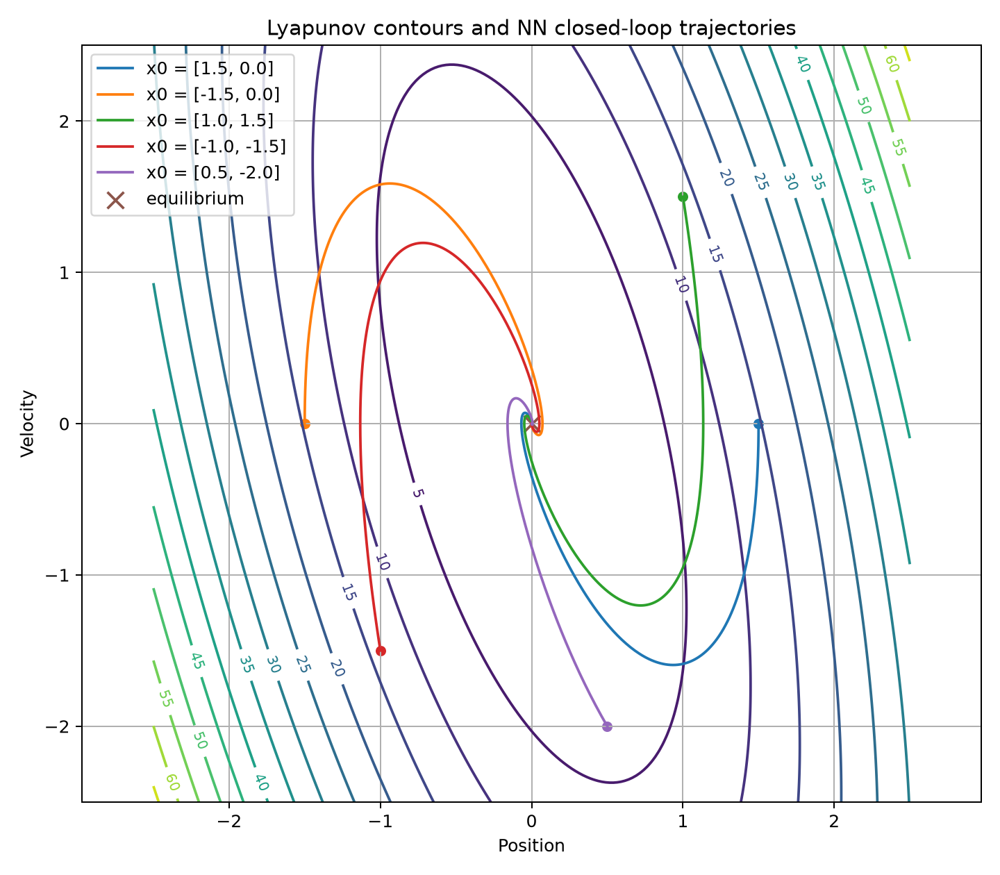

### Region of attraction

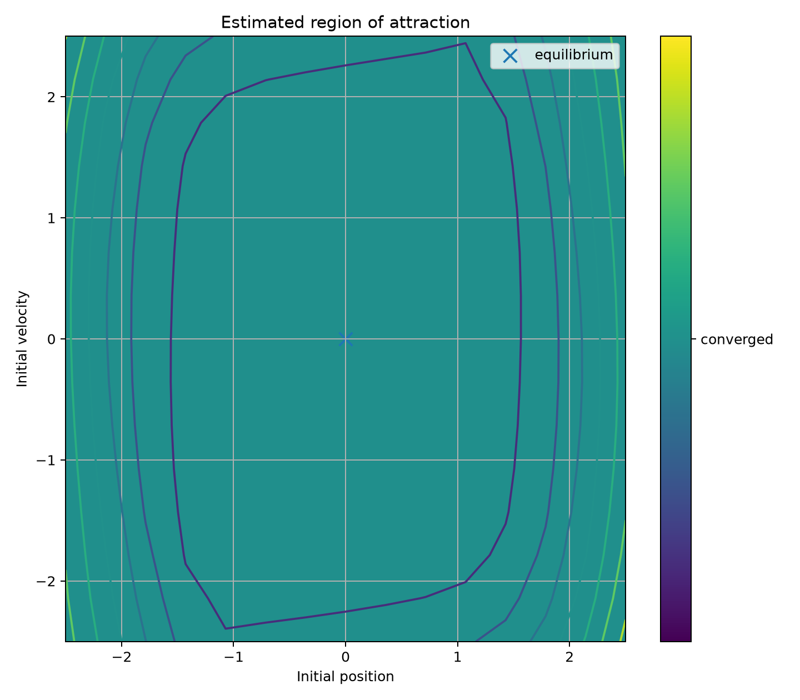

### Region of attraction comparison

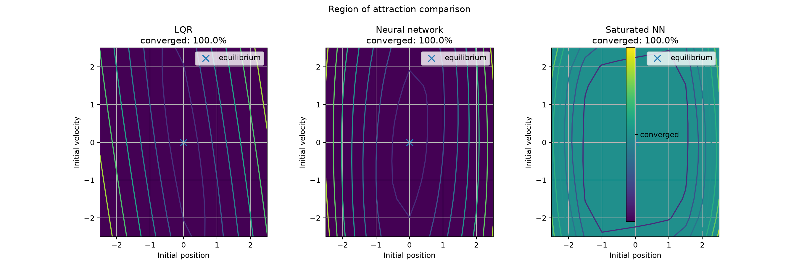

### Stability-weight ablation

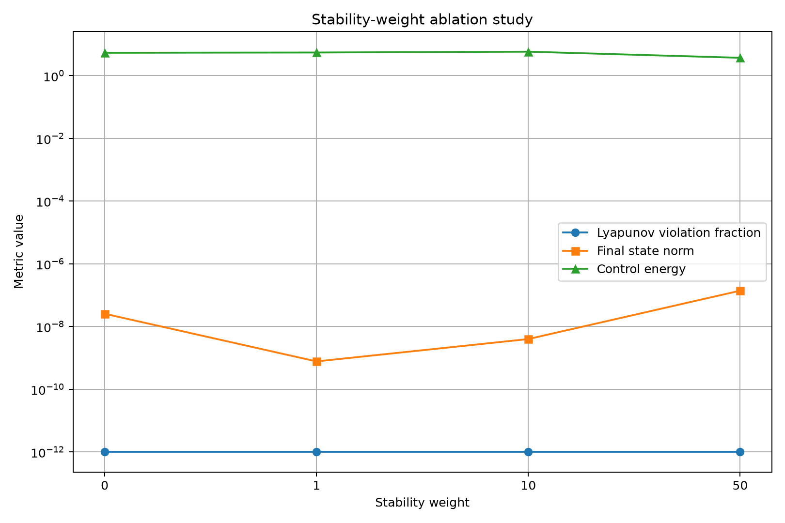


## Project overview

This project combines:

- mechanical system modelling;
- linear quadratic regulator control;
- neural-network controller training;
- closed-loop simulation;
- sampled Lyapunov stability analysis.

The first controlled system is a mass-spring-damper model.

## System model

The physical system is:

```text
m q'' + c q' + k q = u
```

The state vector is:

```text
x = [position, velocity]
```

The state-space model is:

```text
x_dot = A x + B u
```

## Method

1. Define the mass-spring-damper system.
2. design an LQR baseline controller.
3. Generate state and control training data from the LQR controller.
4. Train a neural network to imitate the LQR control law.
5. Simulate the LQR and neural-network controllers.
6. Evaluate the Lyapunov derivative over a sampled state-space grid.

## Results

### Closed-loop position comparison


The neural-network controller produces a response close to the LQR baseline and drives the position toward the equilibrium.

### Neural-network training loss


The decreasing mean-squared error indicates that the neural network progressively learns the LQR control law.

## Lyapunov grid check

| Controller | Maximum V-dot | Violation fraction |
|---|---:|---:|
| LQR | -0.0221 | 0.0 |
| Neural network | -0.0192 | 0.0 |

All tested nonzero grid points produced a negative Lyapunov derivative.

This is empirical evidence within the sampled region. It is not a formal stability proof over the entire continuous state space.

## Installation

Create and activate a virtual environment:

```bash
python -m venv .venv
source .venv/bin/activate
```

Install the dependencies:

```bash
python -m pip install --upgrade pip
pip install -r requirements.txt
```

## Run the experiment

```bash
python main.py
```

The program trains the controller and creates:

```text
results/
├── nn_controller.pt
├── position_comparison.png
└── training_loss.png
```

The trained model file is ignored by Git, while the two result figures are included in the repository.

## Current limitations

- The neural network imitates an existing LQR controller.
- Stability is evaluated on a finite grid.
- Only one initial condition is shown in the main comparison.
- The plant currently has no actuator saturation, measurement noise, or parameter uncertainty.

## Future work

- Add a Lyapunov penalty to the training loss.
- Compare LQR, PID, and neural controllers.
- Test multiple initial conditions.
- Add actuator saturation and measurement noise.
- Study robustness to changes in mass, damping, and stiffness.
- Extend the project to an inverted pendulum.
- Investigate formal neural-network verification.

## Technologies

- Python
- PyTorch
- NumPy
- SciPy
- Matplotlib
- Python Control Systems Library

## Author

Sirichet Sriamontham  
Mechanical Engineering student interested in control engineering, neural networks, and stability analysis.

## License

This project is released under the MIT License. See `LICENSE` for details.

## Quantitative performance evaluation

The experiment compares the LQR and neural-network controllers using:

- final state norm;
- settling time;
- quadratic control cost;
- control energy;
- maximum absolute control input.

The full results for all tested initial conditions are stored in [`results/performance_metrics.csv`](results/performance_metrics.csv).

## Stability-aware training

The neural controller is trained using a combined objective:

```text
total loss = imitation loss + lambda * Lyapunov penalty
```

The imitation term encourages the neural network to reproduce the LQR control law. The Lyapunov term penalizes sampled states that violate the desired decay condition:

```text
V-dot(x) <= -alpha * ||x||^2
```

This encourages stability-related behaviour during training. The sampled Lyapunov evaluation remains empirical and does not constitute formal verification over the full continuous state space.

## Actuator saturation comparison

The project also compares saturated and unsaturated controllers using a fixed actuator limit:

```text
u = clip(u, -u_max, u_max)
```

This models the fact that real actuators cannot apply unlimited control force.

The comparison includes:

- LQR;
- neural-network controller;
- saturated LQR;
- saturated neural-network controller.

The saturation comparison figure is stored in [`results/saturation_comparison.png`](results/saturation_comparison.png).

## Noise robustness experiment

The project evaluates the saturated neural-network controller under noisy state measurements:

```text
x_measured = x + noise
```

This simulates sensor noise, which is common in real control systems.

The experiment compares several Gaussian noise levels and checks whether the closed-loop state still converges toward the equilibrium.

The noise robustness figure is stored in [`results/noise_robustness.png`](results/noise_robustness.png).

## Parameter robustness experiment

The project tests whether the saturated neural-network controller remains stable when the plant parameters differ from the nominal model.

The tested variations include:

- increased and decreased mass;
- reduced damping;
- increased stiffness;
- combined parameter variation.

This evaluates robustness to modelling error, which is important because real mechanical systems rarely match their mathematical model exactly.

The parameter robustness figure is stored in [`results/parameter_robustness.png`](results/parameter_robustness.png).

## Phase portrait

The project includes a phase portrait of the neural-network controller.

The plot shows position on the horizontal axis and velocity on the vertical axis.

Multiple closed-loop trajectories are drawn from different initial conditions to show whether the controller drives the state toward the equilibrium at the origin.

The phase portrait figure is stored in [`results/phase_portrait.png`](results/phase_portrait.png).

## Lyapunov contour plot

The project visualizes Lyapunov level sets together with neural-network closed-loop trajectories.

The contour lines represent values of the quadratic Lyapunov function, while the trajectories show how the neural-network controller moves the system state toward the equilibrium.

The Lyapunov contour figure is stored in [`results/lyapunov_contours.png`](results/lyapunov_contours.png).

## Region of attraction map

The project estimates the region of attraction of the saturated neural-network controller.

A grid of initial position and velocity values is simulated, and each initial state is classified as converged or not converged.

This helps identify which initial conditions are successfully stabilized by the learned controller.

The region of attraction figure is stored in [`results/region_of_attraction.png`](results/region_of_attraction.png).

## Stability-weight ablation study

The project includes an ablation study for the Lyapunov penalty weight used during neural-controller training.

Several controllers are trained with different stability weights, then compared using Lyapunov violation fraction, final state norm, settling time, quadratic cost, and control energy.

This checks whether the Lyapunov-aware training term improves closed-loop stability behavior instead of acting as a decorative loss term.

The ablation results are stored in [`results/stability_weight_ablation.csv`](results/stability_weight_ablation.csv).

The ablation figure is stored in [`results/stability_weight_ablation.png`](results/stability_weight_ablation.png).

## Automatic experiment report

The project automatically generates a Markdown experiment report after running `main.py`.

The report summarizes available plots, performance metrics, and stability-weight ablation results.

The generated report is stored in [`results/experiment_report.md`](results/experiment_report.md).

## Region of attraction controller comparison

The project compares estimated regions of attraction for the LQR controller, the neural-network controller, and the saturated neural-network controller.

Each controller is tested over a grid of initial position and velocity values.

This shows how controller design and actuator limits affect the set of initial states that can be stabilized.

The comparison figure is stored in [`results/region_of_attraction_comparison.png`](results/region_of_attraction_comparison.png).

## Model architecture diagram

The project includes a block diagram of the neural-network closed-loop control architecture.

The diagram shows how the system state is passed into the neural-network controller, converted into a control input, applied to the mass-spring-damper plant, and fed back as the next state.

The architecture diagram is stored in [`results/model_architecture.png`](results/model_architecture.png).

## Methodology documentation

For a paper-style explanation of the control theory, neural-network controller, Lyapunov stability checks, robustness experiments, and region-of-attraction analysis, see [`docs/methodology.md`](docs/methodology.md).

## Citation

This repository includes citation metadata in [`CITATION.cff`](CITATION.cff).

## Project summary

A concise portfolio-style summary is available in [`docs/project_summary.md`](docs/project_summary.md).

## Reproducibility

Instructions for reproducing the experiments are available in [`docs/reproducibility.md`](docs/reproducibility.md).

## Quick-start example

A minimal runnable example is available in [`examples/quick_start.py`](examples/quick_start.py).

Run it with:

```bash
python examples/quick_start.py
```

## Roadmap

Future research directions are listed in [`ROADMAP.md`](ROADMAP.md).

## Contributing

Contribution guidelines are available in [`CONTRIBUTING.md`](CONTRIBUTING.md).

## Security

Security reporting guidance is available in [`SECURITY.md`](SECURITY.md).

## Code of conduct

Community guidelines are available in [`CODE_OF_CONDUCT.md`](CODE_OF_CONDUCT.md).

## Glossary

Important control and machine-learning terms are explained in [`docs/glossary.md`](docs/glossary.md).

## References

Suggested topics and further reading are listed in [`docs/references.md`](docs/references.md).

## Figures guide

Generated plots and result files are explained in [`docs/figures.md`](docs/figures.md).

## Project structure

The repository layout is explained in [`docs/project_structure.md`](docs/project_structure.md).

## Local checks

Run tests and the quick-start example with:

```bash
python scripts/run_checks.py
```

## Cleaning results

Remove generated files from `results/` with:

```bash
python scripts/clean_results.py
```

## Summarizing results

Print a quick terminal summary of generated CSV results with:

```bash
python scripts/summarize_results.py
```

## Troubleshooting

Common setup and runtime issues are explained in [`docs/troubleshooting.md`](docs/troubleshooting.md).

## Command cheat sheet

Useful setup, testing, experiment, and Git commands are listed in [`docs/commands.md`](docs/commands.md).
