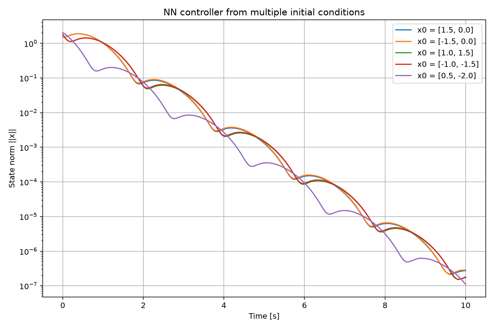
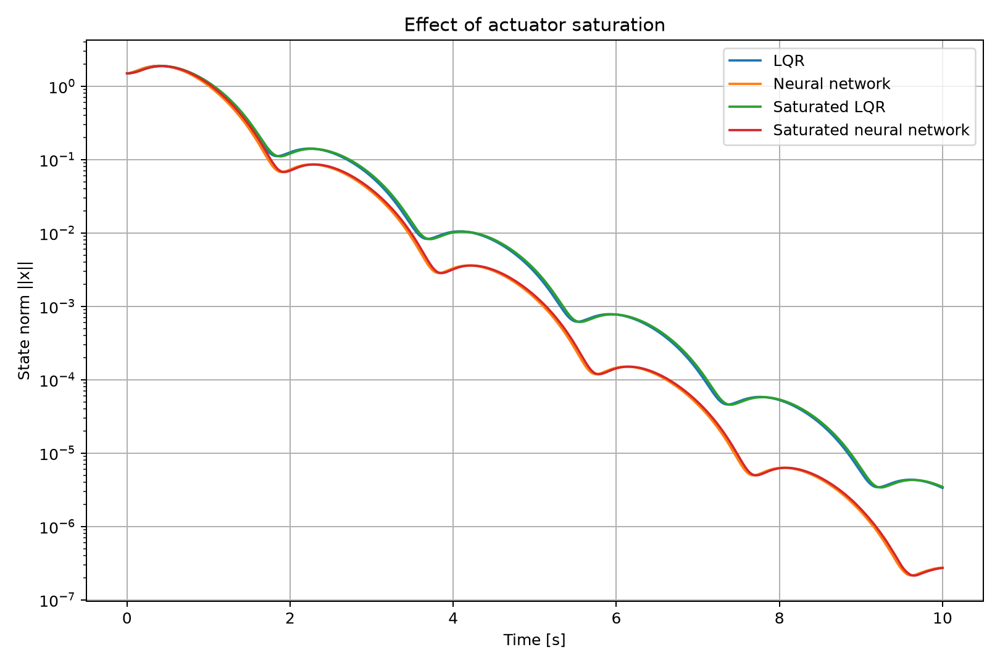
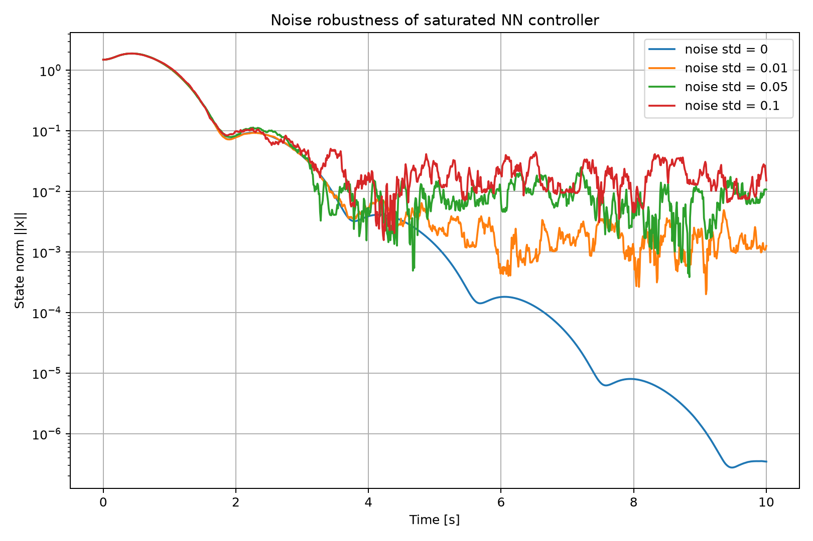
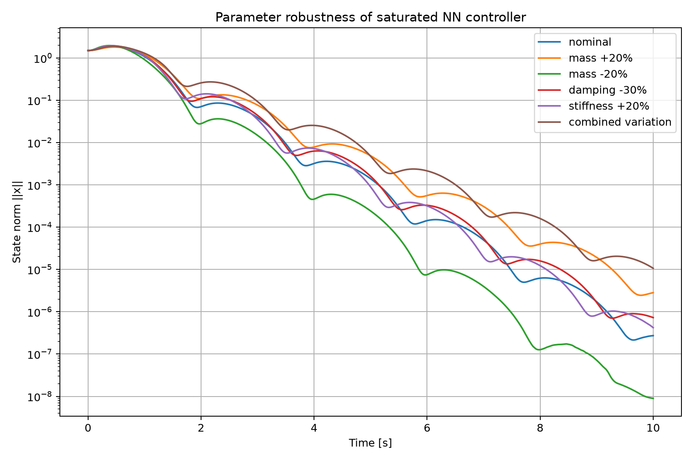
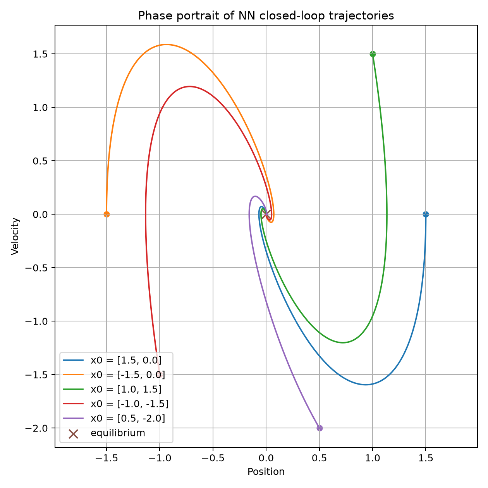
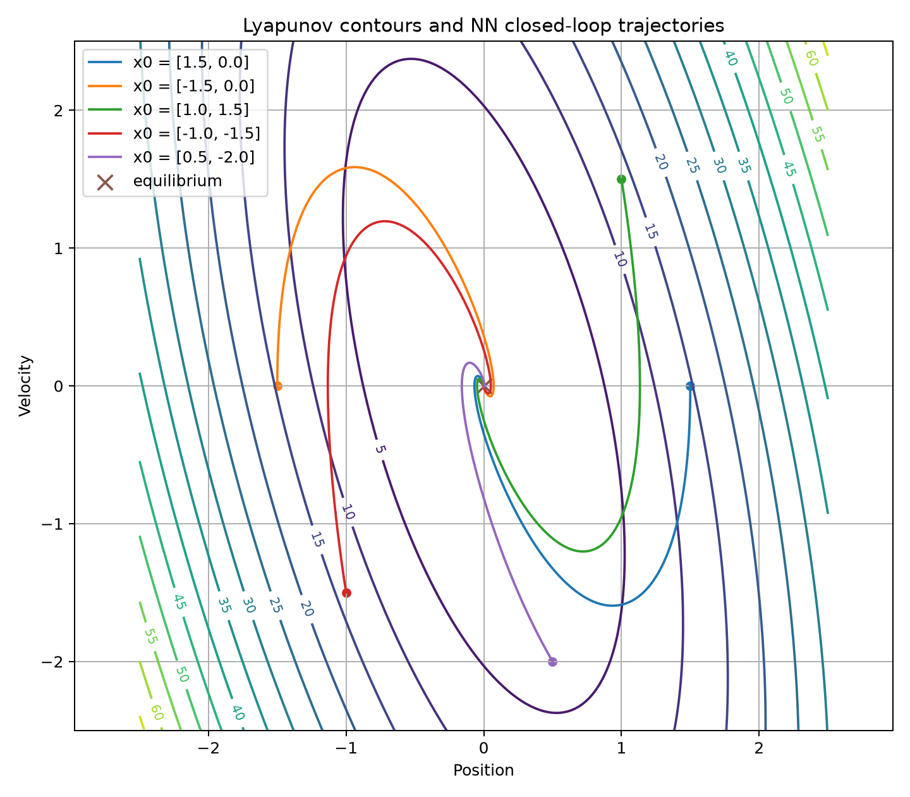
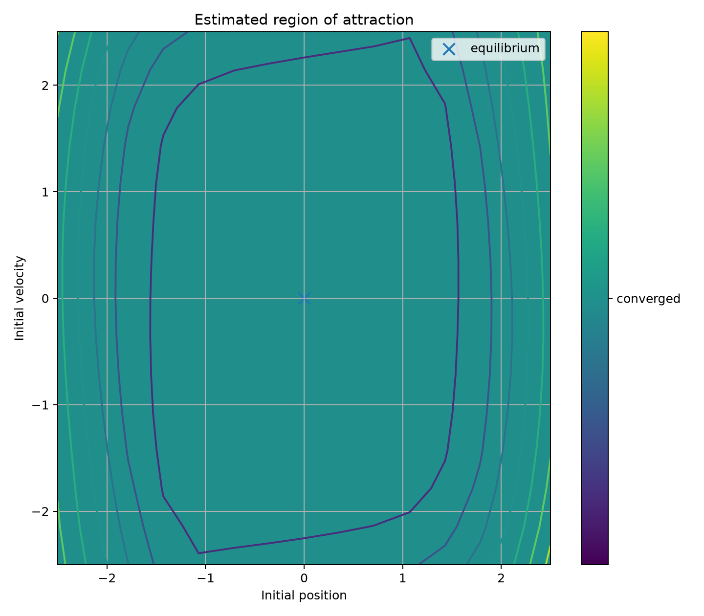
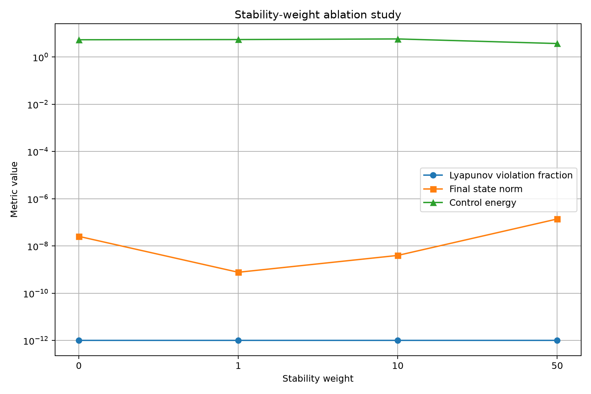

🌐 Language: [English](README.md) | [日本語](README.ja.md) | [한국어](README.ko.md) | [ไทย](README.th.md)


# Lyapunov NN Control Lab

A Python and PyTorch experiment that trains a neural-network controller to imitate an LQR controller and evaluates the closed-loop system using a quadratic Lyapunov function.

## Experiment summary

| Experiment | Purpose | Main output |
|---|---|---|
| Model architecture | Explains the closed-loop NN control structure | `results/model_architecture.png` |
| LQR baseline | Creates a classical optimal-control reference controller | `results/position_comparison.png` |
| Neural-network controller | Trains a neural controller to imitate the LQR law | `results/training_loss.png` |
| Sampled Lyapunov evaluation | Separately reports basic V-dot and decay-margin conditions | Printed terminal results |
| Stability-aware training | Adds a Lyapunov penalty during NN training | `results/training_loss.png` |
| Multiple initial conditions | Tests convergence from several starting states | `results/multiple_initial_conditions.png` |
| Quantitative metrics | Compares normalized-state norm, settling time, LQR-style cost, control effort, and max control | `results/performance_metrics.csv` |
| Actuator saturation | Tests controllers with limited normalized control input | `results/saturation_comparison.png` |
| Noise robustness | Tests the controller under noisy state measurements | `results/noise_robustness.png` |
| Parameter robustness | Tests normalized mass, damping, and stiffness coefficient variations | `results/parameter_robustness.png` |
| Phase portrait | Visualizes closed-loop trajectories in state space | `results/phase_portrait.png` |
| Lyapunov contours | Visualizes quadratic Lyapunov level sets with trajectories | `results/lyapunov_contours.png` |
| Finite-horizon convergence map | Tests a final-state tolerance on a sampled grid at an explicit horizon | `finite_horizon_convergence.png` on the next run; historical artifact retained below |
| Finite-horizon convergence comparison | Compares the same finite-time criterion across LQR, NN, and saturated NN | `finite_horizon_convergence_comparison.png` on the next run; historical artifact retained below |
| Stability-weight ablation | Tests whether stronger Lyapunov penalties improve stability metrics | `results/stability_weight_ablation.png`, `results/stability_weight_ablation.csv` |
| Automatic experiment report | Summarizes generated plots, metrics, and ablation results | `results/experiment_report.md` |

## Results gallery

The committed plots are historical release artifacts and retain their original
English labels, including older `Time [s]` wording. Plot generators now use
normalized-coordinate labels; these tracked figures are intentionally not
regenerated in this semantics-only change.

### Model architecture


### Controller comparison


### Training loss


### Multiple initial conditions



### Actuator saturation



### Noise robustness



### Parameter robustness



### Phase portrait



### Lyapunov contour analysis



### Historical finite-horizon convergence map



The filename above predates the terminology correction. It is retained
unchanged for release reproducibility; future runs write
`finite_horizon_convergence.png`.

### Historical finite-horizon convergence comparison


The filename above is also historical. Future runs write
`finite_horizon_convergence_comparison.png`.

### Stability-weight ablation




## Project overview

This project combines:

- mechanical system modelling;
- linear quadratic regulator control;
- neural-network controller training;
- closed-loop simulation;
- sampled Lyapunov stability analysis.

The first controlled system is a mass-spring-damper model.

The nominal uncontrolled plant is already asymptotically stable: the
eigenvalues of `A` are `-0.2 + 1.4j` and `-0.2 - 1.4j`, both with negative
real part. LQR therefore changes the transient response and optimal-control
trade-off rather than stabilizing an open-loop unstable nominal plant. The
project studies controller imitation, transient performance, robustness, and
preservation of stable behavior.

### Normalized coordinate convention

This repository uses a normalized, dimensionless second-order model. Unless a
document explicitly says otherwise, `tau` is normalized time, `q` is a
normalized position-like coordinate, `v = dq/dtau` is normalized velocity, and
`u` is normalized control input. The state is `x = [q, v]`.

Consequently, `||x||_2 = sqrt(q^2 + v^2)` is an Euclidean norm in normalized
state coordinates. Settling and finite-horizon tolerances, Gaussian noise
standard deviations, and the `||x||_2^2` term in the Lyapunov decay condition
all use these normalized coordinates. `Q` and `R` are weights in a normalized
LQR objective; neither the quadratic cost nor the integral of `u^2` is a
physical energy measurement.

## System model

The normalized model is:

```text
m q'' + c q' + k q = u
```

The state vector is:

```text
x = [q, v] = [normalized position, normalized velocity]
```

The state-space model is:

```text
dx/dtau = A x + B u
```

## Method

1. Define the mass-spring-damper system.
2. design an LQR baseline controller.
3. Generate state and control training data from the LQR controller.
4. Train a neural network to imitate the LQR control law.
5. Simulate the LQR and neural-network controllers.
6. Evaluate the Lyapunov derivative over a sampled state-space grid.

## Results

### Closed-loop position comparison


The neural-network controller produces a response close to the LQR baseline and drives the position toward the equilibrium.

### Neural-network training loss


The decreasing mean-squared error indicates that the neural network progressively learns the LQR control law.

## Sampled Lyapunov evaluation

| Controller | Maximum V-dot | Sampled V-dot positivity violation fraction |
|---|---:|---:|
| LQR | -0.0221 | 0.0 |
| Neural network | -0.0192 | 0.0 |

These historical results show that every tested nonzero grid point had a
negative Lyapunov derivative. They report the basic condition only:

```text
V-dot(x) <= 0
```

The current evaluator also reports the stronger condition used during
stability-aware training:

```text
V-dot(x) + alpha * ||x||_2^2 <= 0
```

The two violation fractions are named separately. The exact equilibrium is
excluded, and all other points on the finite grid are evaluated. These checks
provide empirical sampled evidence only; they are not a formal certificate over
the continuous state space. The tracked historical CSV and figures will be
regenerated later in the dedicated result-provenance operation.

## Installation

Create and activate a virtual environment:

```bash
python -m venv .venv
source .venv/bin/activate
```

Install the project for normal use:

```bash
python -m pip install --upgrade pip
python -m pip install -e .
```

For development, tests, and package builds, install the development extra:

```bash
python -m pip install -e ".[dev]"
```

## Run the experiment

```bash
python main.py
```

The command refuses an official run when the Git working tree is dirty. A
successful run is generated in staging, verified, and then published without
deleting previous runs:

```text
results/runs/<run_id>/
├── manifest.json
├── SHA256SUMS
├── report.md
├── raw and aggregate CSV files
├── figures
└── nn_controller.pt
```

The manifest records source code, environment, effective configuration, exact
seed sets, pairing methods, inventory, sizes, and SHA-256 checksums. Verify it
with `python scripts/verify_run.py results/runs/<run_id>`. Use
`python main.py --allow-dirty` only for an exploratory run; its manifest records
that the working tree was dirty.

## Current limitations

- The neural network imitates an existing LQR controller.
- Stability is evaluated on a finite grid.
- Only one initial condition is shown in the main comparison.
- The plant currently has no actuator saturation, measurement noise, or parameter uncertainty.

## Future work

- Add a Lyapunov penalty to the training loss.
- Compare LQR, PID, and neural controllers.
- Test multiple initial conditions.
- Add actuator saturation and measurement noise.
- Study robustness to changes in normalized mass, damping, and stiffness coefficients.
- Extend the project to an inverted pendulum.
- Investigate formal neural-network verification.

## Technologies

- Python
- PyTorch
- NumPy
- SciPy
- Matplotlib
- Python Control Systems Library

## Author

Sirichet Sriamontham  
Mechanical Engineering student interested in control engineering, neural networks, and stability analysis.

## License

This project is released under the MIT License. See `LICENSE` for details.

## Quantitative performance evaluation

The experiment compares the LQR and neural-network controllers using:

- final normalized-state norm;
- settling time in normalized time;
- quadratic LQR-style cost;
- integrated squared control effort;
- maximum absolute normalized control input.

The historical CSV field names `settling_time_s` and `control_energy` are kept
as compatibility aliases. They mean normalized settling time and integrated
squared normalized control effort, respectively; they do not denote seconds or
physical energy.

The full results for all tested initial conditions are stored in [`results/performance_metrics.csv`](results/performance_metrics.csv).

## Stability-aware training

The neural controller is trained using a combined objective:

```text
total loss = imitation loss + lambda * Lyapunov penalty
```

The imitation term encourages the neural network to reproduce the LQR control
law. The Lyapunov term uses `alpha = 0.05` and penalizes positive sampled decay
residuals:

```text
decay residual = V-dot(x) + alpha * ||x||_2^2
Lyapunov penalty = mean(ReLU(decay residual))
```

The numerical tolerance used to classify evaluation violations is separate from
`alpha`; it does not weaken or redefine the training objective.

## Actuator saturation comparison

The project also compares saturated and unsaturated controllers using a fixed actuator limit:

```text
u = clip(u, -u_max, u_max)
```

This models a limit on the normalized control input.

The comparison includes:

- LQR;
- neural-network controller;
- saturated LQR;
- saturated neural-network controller.

The saturation comparison figure is stored in [`results/saturation_comparison.png`](results/saturation_comparison.png).

## Noise robustness experiment

The project evaluates the saturated neural-network controller under noisy state measurements:

```text
x_measured = x + noise
```

This simulates sensor noise, which is common in real control systems.

One scalar standard deviation is applied independently to both normalized state
coordinates. The experiment compares several Gaussian noise levels and checks
whether the closed-loop state still converges toward the equilibrium.

Future runs compare every noise amplitude with the same repeated seed set. For
each seed, one standardized Gaussian realization is scaled by each amplitude
(common random numbers), so amplitude is not confounded with an unrelated
noise draw. Raw `noise_std x seed` trials and aggregate means, sample standard
deviations, and standard errors are saved separately. Fixed seeds support
repeatable comparisons; they do not eliminate all numerical or platform
uncertainty.

The tracked [`results/noise_robustness.png`](results/noise_robustness.png) is a
historical artifact from the earlier single-seed design and is intentionally
unchanged. Future paired runs use `noise_robustness_*_paired` result files.

## Parameter robustness experiment

The project tests whether the saturated neural-network controller remains stable when the plant parameters differ from the nominal model.

The tested variations include:

- increased and decreased normalized mass coefficient;
- reduced normalized damping coefficient;
- increased normalized stiffness coefficient;
- combined parameter variation.

This evaluates robustness to modelling error, which is important because real mechanical systems rarely match their mathematical model exactly.

The parameter robustness figure is stored in [`results/parameter_robustness.png`](results/parameter_robustness.png).

## Phase portrait

The project includes a phase portrait of the neural-network controller.

The plot shows normalized position on the horizontal axis and normalized velocity on the vertical axis.

Multiple closed-loop trajectories are drawn from different initial conditions to show whether the controller drives the state toward the equilibrium at the origin.

The phase portrait figure is stored in [`results/phase_portrait.png`](results/phase_portrait.png).

## Lyapunov contour plot

The project visualizes Lyapunov level sets together with neural-network closed-loop trajectories.

The contour lines represent values of the quadratic Lyapunov function, while the trajectories show how the neural-network controller moves the system state toward the equilibrium.

The Lyapunov contour figure is stored in [`results/lyapunov_contours.png`](results/lyapunov_contours.png).

## Finite-horizon convergence map

For each sampled initial state `x0`, the project simulates `x(t; x0)` over
`0 <= t <= T` and applies the strict final-state tolerance criterion:

```text
||x(T)||_2 < epsilon
```

The evaluator requires the solver to succeed, reach `T`, and return a finite
trajectory. A failed or nonfinite simulation raises an error instead of being
silently labelled nonconverged.

Here, `T` is a normalized-time horizon and `epsilon` is a strict Euclidean
tolerance in normalized state coordinates. The output records `T`, `epsilon`, grid bounds and resolution, tested and
converged counts, and the resulting fraction. A state that misses this
finite-time tolerance may still converge asymptotically after `T`; therefore
the map is not a mathematical region of attraction or a stability
certificate.

Future runs store the map as `results/finite_horizon_convergence.png`. The
tracked [`results/region_of_attraction.png`](results/region_of_attraction.png)
is a historical artifact with the old filename and is intentionally unchanged.

## Stability-weight ablation study

The project includes an ablation study for the Lyapunov penalty weight used during neural-controller training.

Several controllers are trained with different stability weights, then compared using Lyapunov violation fraction, final normalized-state norm, normalized settling time, quadratic LQR-style cost, and integrated squared control effort.

Future runs evaluate the Cartesian product of stability weights and a shared
seed list. Every weight therefore uses identical model-initialization seeds.
The raw table contains one `stability_weight x seed` trial; a separate summary
reports the mean, sample standard deviation, and standard error for each
weight. A single-repeat summary reports unavailable variability as `NaN`, not
as a false zero.

This checks whether the Lyapunov-aware training term improves closed-loop stability behavior instead of acting as a decorative loss term.

The tracked [`results/stability_weight_ablation.csv`](results/stability_weight_ablation.csv)
and [`results/stability_weight_ablation.png`](results/stability_weight_ablation.png)
are historical artifacts from the earlier confounded seed design. They remain
unchanged; future paired runs use `stability_weight_ablation_*_paired` files and
do not relabel the historical results.

## Automatic experiment report

The project automatically generates a Markdown experiment report after running `main.py`.

The report summarizes available plots, performance metrics, and stability-weight ablation results.

The generated report is stored in [`results/experiment_report.md`](results/experiment_report.md).

## Finite-horizon convergence comparison

The project applies the same horizon, strict final-state tolerance, bounds,
and grid resolution to the LQR, neural-network, and saturated neural-network
controllers. The comparison reports sampled counts and percentages; it does
not compare certified attraction basins.

Future runs store the comparison as
`results/finite_horizon_convergence_comparison.png`. The tracked
[`results/region_of_attraction_comparison.png`](results/region_of_attraction_comparison.png)
is retained only as a historical artifact.

## Mathematical region of attraction

For an equilibrium at the origin, the region of attraction is conceptually

```text
R = {x0 : x(t; x0) -> 0 as t -> infinity}.
```

A defensible estimate may require invariant Lyapunov sublevel sets with
verified decrease, sum-of-squares methods where applicable,
reachability/invariance analysis, formal verification, or analytic linear
results. A plotted sublevel set `{x : V(x) <= c}` is not automatically a
certified attraction region. Neither this project's sampled finite-horizon
map nor its separate sampled Lyapunov checks provide a formal continuous-state
certificate.

## Model architecture diagram

The project includes a block diagram of the neural-network closed-loop control architecture.

The diagram shows how the system state is passed into the neural-network controller, converted into a control input, applied to the mass-spring-damper plant, and fed back as the next state.

The architecture diagram is stored in [`results/model_architecture.png`](results/model_architecture.png).

## Methodology documentation

For a paper-style explanation of the control theory, neural-network controller, Lyapunov stability checks, robustness experiments, finite-horizon convergence analysis, and the distinction from a mathematical attraction region, see [`docs/en/methodology.md`](docs/en/methodology.md).

## Citation

This repository includes citation metadata in [`CITATION.cff`](CITATION.cff).

## Project summary

A concise portfolio-style summary is available in [`docs/en/project_summary.md`](docs/en/project_summary.md).

## Reproducibility

Instructions for reproducing the experiments are available in [`docs/reproducibility.md`](docs/reproducibility.md).

## Quick-start example

A minimal runnable example is available in [`examples/quick_start.py`](examples/quick_start.py).

Run it with:

```bash
python examples/quick_start.py
```

## Roadmap

Future research directions are listed in [`ROADMAP.md`](ROADMAP.md).

## Contributing

Contribution guidelines are available in [`CONTRIBUTING.md`](CONTRIBUTING.md).

## Security

Security reporting guidance is available in [`SECURITY.md`](SECURITY.md).

## Code of conduct

Community guidelines are available in [`CODE_OF_CONDUCT.md`](CODE_OF_CONDUCT.md).

## Glossary

Important control and machine-learning terms are explained in [`docs/glossary.md`](docs/glossary.md).

## References

Suggested topics and further reading are listed in [`docs/references.md`](docs/references.md).

## Figures guide

Generated plots and result files are explained in [`docs/figures.md`](docs/figures.md).

## Project structure

The repository layout is explained in [`docs/project_structure.md`](docs/project_structure.md).

## Local checks

Run tests and the quick-start example with:

```bash
python scripts/run_checks.py
```

## Cleaning results

Remove only abandoned `.staging-*` directories with:

```bash
python scripts/clean_results.py
```

Completed runs and historical root-level artifacts are preserved.

## Summarizing results

Print a quick terminal summary of generated CSV results with:

```bash
python scripts/summarize_results.py
```

## Troubleshooting

Common setup and runtime issues are explained in [`docs/troubleshooting.md`](docs/troubleshooting.md).

## Command cheat sheet

Useful setup, testing, experiment, and Git commands are listed in [`docs/commands.md`](docs/commands.md).

## Results interpretation

Guidance for reading metrics, plots, Lyapunov checks, and robustness results is available in [`docs/results_interpretation.md`](docs/results_interpretation.md).

## Limitations

Important assumptions and limitations are described in [`docs/limitations.md`](docs/limitations.md).

## Experiment workflow

A recommended experiment workflow is available in [`docs/experiment_workflow.md`](docs/experiment_workflow.md).

## Full experiment pipeline

Run the non-destructive provenance-aware experiment pipeline with:

```bash
python scripts/run_full_experiment.py
```

## Presentation outline

A ready-to-use presentation structure is available in [`docs/presentation_outline.md`](docs/presentation_outline.md).

## KAN extension

Ideas for extending the project toward KAN-based controller experiments are described in [`docs/kan_extension.md`](docs/kan_extension.md).

## Model card

A model card for the neural-network controller is available in [`docs/model_card.md`](docs/model_card.md).

## Research questions

Possible research questions and thesis directions are listed in [`docs/research_questions.md`](docs/research_questions.md).

## Thesis plan

A possible graduation thesis plan based on this repository is available in [`docs/thesis_plan.md`](docs/thesis_plan.md).

## Defense questions

Possible presentation and thesis-defense questions are collected in [`docs/defense_questions.md`](docs/defense_questions.md).

## Documentation index

A map of the documentation files is available in [`docs/en/index.md`](docs/en/index.md).

## Documentation link checker

Check local Markdown links in the README and documentation files with:

```bash
python scripts/check_docs_links.py
```

The local check command validates documentation links, tests, and the quick-start example:

```bash
python scripts/run_checks.py
```

## Continuous integration

GitHub Actions runs local checks automatically on pushes and pull requests using [`scripts/run_checks.py`](scripts/run_checks.py).

## Build status

[](https://github.com/wolfchil345/lyapunov-nn-control-lab/actions/workflows/local-checks.yml)

## Editor configuration

The repository includes `.editorconfig` to keep indentation, line endings, and whitespace consistent across editors.

## Git attributes

The repository includes `.gitattributes` to keep text line endings and binary files handled consistently by Git.

## Python project metadata

The repository includes `pyproject.toml` with basic project metadata and pytest configuration.

## Environment setup

See the [environment setup guide](docs/environment.md) for Python version, virtual environment, dependency installation, and local checks.

## Artifact manifest

See the [artifact manifest](docs/artifact_manifest.md) for an overview of source files, scripts, generated plots, reports, and result summaries.

## VS Code setup

See the [VS Code setup guide](docs/vscode.md) for recommended extensions, pytest settings, Codespaces notes, and common terminal workflow.

## Codespaces setup

See the [Codespaces setup guide](docs/codespaces.md) for the dev container, automatic dependency installation, extensions, and workflow notes.

## Environment checker

Run `python scripts/check_environment.py` to diagnose Python, required project files, the installed package, and its runtime dependencies.

## Dependency troubleshooting

See the [dependency troubleshooting guide](docs/dependency_troubleshooting.md) for runtime import errors, virtual environment resets, and Codespaces recovery.

## Command shortcuts

The repository includes a `Makefile` for common shortcuts such as `make check-env`, `make checks`, `make test`, and `make experiment`.

## Dependency updates

See the [dependency updates guide](docs/dependency_updates.md) for Dependabot behavior and the update review checklist.

## Security scanning

See the [security scanning guide](docs/security_scanning.md) for CodeQL workflow behavior and review notes.

## Branch protection

See the [branch protection guide](docs/branch_protection.md) for recommended `main` branch rules and required checks.

## Pull request review

See the [pull request review guide](docs/pull_request_review.md) for the recommended checklist before merging feature branches.

## Release checklist

See the [release checklist](docs/release_checklist.md) before tagging a release or submitting the project for review.

## Demo guide

See the [five minute demo script](docs/demo_script.md) for a quick explanation flow for professors, reviewers, interviews, and lab discussions.

## Portfolio pitch

See the [portfolio pitch](docs/portfolio_pitch.md) for a concise explanation for CVs, interviews, professor visits, and graduate applications.

## FAQ

See the [FAQ](docs/faq.md) for quick answers about the project goal, LQR reference controller, Lyapunov-style checks, and limitations.

## Experiment parameters

See the [experiment parameters guide](docs/experiment_parameters.md) for the main settings that affect training, simulation, Lyapunov checks, robustness tests, and results.

## Experiment log template

See the [experiment log template](docs/experiment_log_template.md) for recording experiment settings, results, comparisons, and observations.

## Result file naming

See the [result file naming guide](docs/result_naming.md) for organizing plots, metrics, reports, robustness outputs, and experiment comparisons.

## Experiment log generator

Create a timestamped experiment log from the template with:

```bash
python scripts/new_experiment_log.py "baseline seed 0"
```

## Result inventory

List generated result files with:

```bash
python scripts/list_results.py
```

## Result review checklist

See the [result review checklist](docs/result_review_checklist.md) before using generated plots, metrics, Lyapunov outputs, robustness outputs, or reports.

## Project status

Check important project files, documentation, scripts, tests, workflows, and result files with:

```bash
python scripts/project_status.py
```

Or use:

```bash
make status
```

## Quality gate

Run the full project readiness check with:

```bash
python scripts/quality_gate.py
```

Or use:

```bash
make quality-gate
```

## Automated quality gate

GitHub Actions runs the quality gate automatically with `.github/workflows/quality-gate.yml` on pushes and pull requests to `main`.

## Quality gate guide

See the [quality gate guide](docs/quality_gate.md) for how to run the full readiness check and fix common failures.

## CI workflows guide

See the [CI workflows guide](docs/ci_workflows.md) for how GitHub Actions, badges, and quality checks are organized.

## Project status guide

See the [project status guide](docs/project_status.md) for how repository health is checked.

## Maintenance guide

See the [maintenance guide](docs/maintenance.md) for routine checks before merges, demos, and repository updates.

## Git workflow guide

See the [Git workflow guide](docs/git_workflow.md) for the project branch, commit, merge, and cleanup process.

## Onboarding guide

See the [onboarding guide](docs/onboarding.md) for the first steps to run, test, and understand this project.

## Multilingual documentation

This project is being organized for English, Japanese, Korean, and Thai readers. See the [internationalization guide](docs/en/i18n.md).
